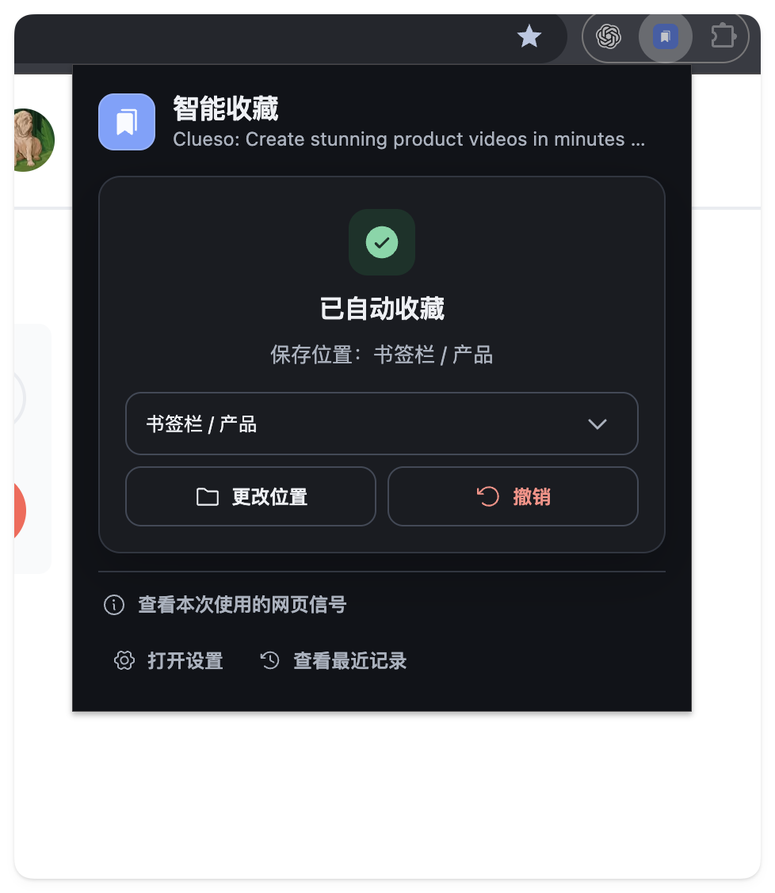

<div align="center">


# 智能收藏 / Smart Favorites

让 Chrome 根据现有书签目录，自动把当前网页收藏到合适的位置。

[](https://github.com/sunyifeng11111/Smart-Favorites/releases/latest)
[](https://github.com/sunyifeng11111/Smart-Favorites/actions/workflows/ci.yml)


[下载最新版本](https://github.com/sunyifeng11111/Smart-Favorites/releases/latest) · [安装](#安装) · [隐私边界](#隐私边界) · [本地开发](#本地开发)

<br />



</div>

智能收藏是一款本地优先的 Chrome 扩展。打开扩展后，它会读取当前网页的有限信号和你已有的书签目录，请 JEV 选择最合适的位置。判断足够可靠时自动收藏，不确定时交给你确认，所有变更都可以更改位置或撤销。

> [!IMPORTANT]
> 智能分类需要你自己的 JEV API 密钥。项目不包含共享密钥、账号系统、产品后端或远程遥测。

## 功能

- 根据现有书签目录自动分类，不创建复杂的新目录结构。
- 展示完整目录路径，支持多层子目录和同名目录。
- 结果不确定时提供候选目录和完整目录选择器。
- 自动收藏后可以更改位置或立即撤销。
- 收藏前检测重复链接，避免无意创建重复记录。
- 服务失败时保存到待分类目录，稍后可原地重试。
- 支持排除不参与分类的目录子树。
- 最近记录只保存在本地，可单条删除、全部清除或手动导出。
- 自动适配 Chrome 的浅色和深色模式。

## 安装

1. 打开 [Releases](https://github.com/sunyifeng11111/Smart-Favorites/releases/latest)，下载 `smart-favorites-<version>-chrome.zip`。
2. 解压 ZIP 文件。
3. 在 Chrome 地址栏打开 `chrome://extensions`。
4. 开启右上角的“开发者模式”。
5. 点击“加载已解压的扩展程序”，选择包含 `manifest.json` 的解压目录。
6. 将“智能收藏”固定到浏览器工具栏。

> [!NOTE]
> Chrome 不支持直接安装普通 ZIP。每次下载新版本后，需要解压并重新加载扩展目录。

## 使用

### 1. 连接 JEV

首次使用时打开设置页：

1. 阅读并允许智能分类所需的数据共享。
2. 输入自己的 JEV API 密钥并保存。
3. 点击“测试连接”。

密钥保存后输入框会锁定。需要替换时点击“修改密钥”；连接失败时输入框会重新开放。

### 2. 收藏当前网页

在普通 HTTP 或 HTTPS 网页上点击扩展图标：

- 高可信结果会自动收藏，并显示最终目录。
- 不确定结果会显示候选目录，由你确认。
- 没有合适目录或连接失败时，网页会进入待分类目录。
- 已存在相同链接时，扩展会先提示，不会自动移动历史书签。

## 隐私边界

智能分类只会向 `https://api.typesafe.ai/*` 发送：

- 当前网页的标题、URL、域名、description、可见 H1 和最多 4,000 个可见字符。
- 可分类书签目录的完整路径。
- 每个目录最多三个示例书签的标题和域名。

扩展不会采集表单内容、输入值、密码字段、脚本、样式、导航或隐藏内容。`file:`、`chrome:`、`data:` 等页面不会发送给 JEV；无痕窗口中智能收藏完全停用，也不会写入最近记录。

API 密钥、设置和最近记录保存在 `chrome.storage.local`。该存储并未加密，请只在可信设备上使用。卸载扩展或清除扩展数据会删除这些本地信息。

## 本地开发

需要 Node.js 22、pnpm 10.17.1，以及 Chromium 或 Google Chrome。

```bash
git clone https://github.com/sunyifeng11111/Smart-Favorites.git
cd Smart-Favorites
pnpm install --frozen-lockfile
pnpm dev
```

WXT 会在 `.output/chrome-mv3/` 生成开发构建，可通过 Chrome 的“加载已解压的扩展程序”载入。

生成生产构建和版本化 ZIP：

```bash
pnpm build
pnpm package
```

## 质量检查

```bash
pnpm compile
pnpm lint
pnpm test
pnpm test:browser
pnpm package
```

浏览器测试会构建真实 Manifest V3 扩展，并验证设置持久化、网页信号捕获、自动收藏、修改位置、撤销、重复收藏提示及失败重试流程。

## 项目结构

```text
entrypoints/          Chrome Service Worker、popup 和设置页
src/application/      智能收藏应用服务与领域逻辑
src/adapters/         Chrome API、页面捕获与 JEV 客户端
src/evaluation/       分类质量评估与发布门槛
src/release/          Manifest 和发布产物验证
e2e/                  Playwright 扩展集成测试
evaluation/           评估结构与合成示例
```

更完整的架构约束见 [`CONTEXT.md`](CONTEXT.md) 和 [`docs/adr/0001-local-first-byok-jev-integration.md`](docs/adr/0001-local-first-byok-jev-integration.md)。
